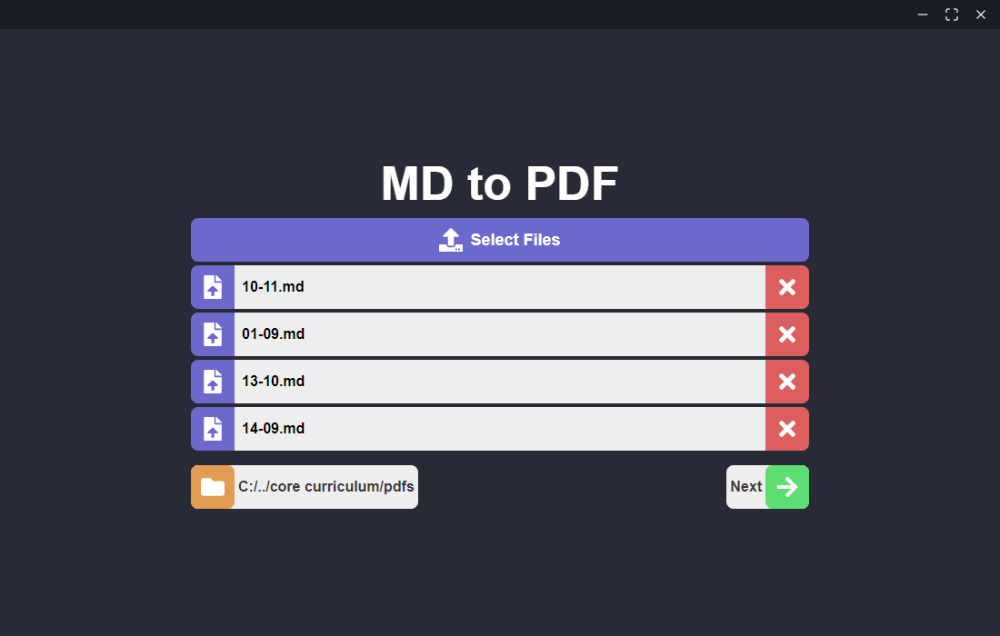

# 📕 MD-PDF

Electron application to convert MD files to PDF

<center>
  
</center>

## 🛠️ Installation

Use a package manager of your choice (npm, yarn, etc.) in order to install all dependencies

```bash
npm install
```

```bash
yarn install
```

## Usage
In order to run this project 2 scripts will need to be executed `dev:react` and `dev:electron`, run each one in a different terminal and always run `dev:react` before `dev:electron`, or `dev` to run them in order automatically

```bash
npm run dev:react
```
```bash
npm run dev:electron
```

or

```bash
npm run dev
```

## Packaging
To generate a project package run `package`

```bash
npm run package
```

## Boilerplate

* [diego3g/electron-typescript-react](https://github.com/diego3g/electron-typescript-react)

## 💼 Authors

* **Luiz Gustavo** - *Development* - [iamtheluiz](https://github.com/iamtheluiz)

## 📃 License

This project is under the GNU License - see the [LICENSE](./LICENSE) file for details.
